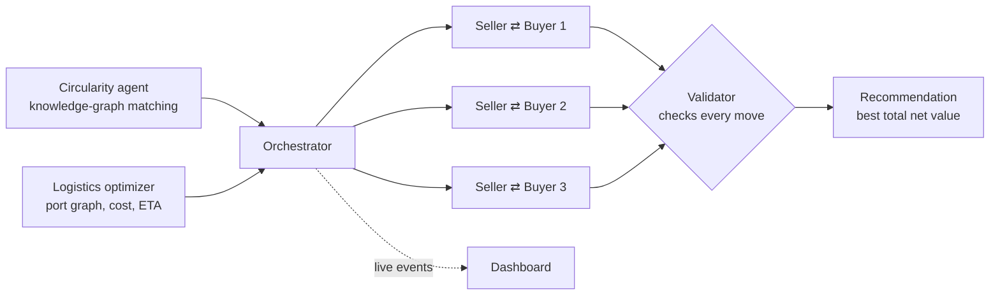

# CIRCUIT — autonomous circular supply-chain agents

CIRCUIT turns an industrial by-product into a closed deal. Given a seller's waste
material, it finds buyers who can reuse it, prices the shipping route, and lets **LLM
agents negotiate the deal live** — a seller agent bargaining with several buyer agents at
once — while a deterministic validator makes sure no agent can invent a price, leak a
secret, or bluff about a competing offer.

**Demo scenario:** Tata Steel BSL (Angul, India) has 100,000 t/year of LD (steelmaking)
slag. Cement makers in Bangladesh can use it as a clinker substitute. CIRCUIT matches the
slag to compatible cement buyers, routes it from Dhamra port, negotiates with the top three
buyers simultaneously, and recommends the deal with the highest total net value — with an
estimated CO₂ saving.

**Track:** Supply Chain Circularity & Industrial Symbiosis.

### 🎬 Demo video: [watch on Google Drive](https://drive.google.com/file/d/1LZr_9DCnMF5REItjaaY10pZ8Ihch80gH/view?usp=sharing)

### ▶ Live demo: <https://circularity-agent-live-demo.onrender.com/>

Open the link and start a **Replay** to watch a full recorded negotiation, or **Live** to
run the agents for real (about a minute). Hosted on Render's free tier — after a period of
inactivity the first load can take up to a minute while the service wakes up.

> **Please use Live sparingly.** Every live run spends ~25–50 requests from the team's
> free-tier LLM quota, which allows only a handful of runs per day. **Replay** shows the
> same dashboard and agent behaviour at no cost — use it for browsing, and start one
> Live run only when you want to see the agents negotiate in real time. To experiment
> freely, run the project locally with your own API keys (see *Quick start*).

---

## The problem

Heavy industry produces millions of tonnes of by-products — steel slag, fly ash, spent
catalysts — that another industry could use as raw material. Most of it is landfilled or
sold cheaply because connecting a producer to the right buyer is slow, manual work:
finding who can technically use the material, checking quality specs, pricing freight,
and negotiating terms one buyer at a time. Every deal that doesn't happen means disposal
costs for the seller, virgin raw material (and its emissions) for the buyer.

LLM agents could automate this, but a negotiating LLM left alone will happily invent a
price, reveal its client's walk-away number, or bluff about offers that don't exist.
CIRCUIT's answer: **let the LLMs negotiate, but make every number they use pass a
deterministic check first.**

---

## How it works



1. **Match** — a knowledge graph links *material → application → buyer*. A buyer qualifies
   only if the slag's composition meets its quality thresholds; each match comes with a
   readable reasoning path (`LD slag → cement clinker substitute → Shah Cement`).
2. **Route** — the logistics optimizer finds the cheapest sea route that meets the
   deadline and returns distance, transit days and freight per tonne.
3. **Negotiate** — one seller agent and three buyer agents, each a separate LLM context
   that knows only its own limits (floor price, ceiling, demand, contract range). Agents
   make moves as structured JSON: offer, accept, reject, or ask for information.
4. **Validate** — every move passes a deterministic gate before the other side sees it:
   an agent may only offer within its *own* limits, may only quote numbers that are
   grounded in the conversation, may not reveal its own reservation price, and the seller
   may not claim a "better offer elsewhere" unless one really exists in another live
   negotiation. Invalid moves bounce back to the agent to retry; repeated failures hand the
   move to a deterministic fallback — visibly, never silently.
5. **Compete** — the negotiations influence each other: a real bid in one thread raises
   the seller's floor in the others.
6. **Decide** — the orchestrator picks the agreed deal with the highest total net value
   (`(price − freight − handling − processing) × quantity`) and releases the rest.

The dashboard streams all of this live: buyer cards, one chat thread per negotiation,
private agent reasoning, validator bounces, a price-convergence chart and the final
recommendation card.

---

## Tech stack

| Layer | Technology |
|---|---|
| Language | Python 3.11+ |
| LLM agents | Google **Gemini 3.1 Flash-Lite** (primary; Gemini 3.5 Flash / 3 Flash as backups), **NVIDIA NIM DeepSeek V4 Flash** (last-resort backup), OpenRouter (optional) — all called through the `openai` Python SDK against each provider's OpenAI-compatible API |
| Agent protocol | Structured JSON moves, validated by deterministic Python gates; per-provider pacing, daily-quota tracking and fallback chains |
| Matching | Knowledge graph (material → application → buyer) with threshold-based traversal, pure Python |
| Routing | Port graph with path enumeration, haversine distances, freight and transit-time model, pure Python |
| Backend / API | FastAPI, Pydantic, Uvicorn; live updates over Server-Sent Events (SSE) |
| Dashboard | Vanilla HTML, CSS and JavaScript with inline SVG charts — no front-end build step |
| Data | JSON snapshot (seller, 25 buyers, materials, ports, routes) generated from researched anchors |
| Config | `python-dotenv` (`.env`, gitignored) |
| Testing | `unittest` (pytest-compatible), 94 offline tests — every provider call is blocked in tests |
| Deployment | Render (`render.yaml`, free web-service plan) |

---

## How it maps to the judging criteria

**Agentic AI implementation.** Four LLM agents make real decisions: a seller agent runs
three negotiations at once and each buyer agent bargains for its own company, with private
information on both sides. They choose offers, concessions, contract terms and when to
walk away. The LLM *proposes*; a deterministic validator *decides* whether each move is
legal — so agent autonomy never comes at the cost of invented numbers. In live runs the
validator has caught agents bluffing ("we have a better offer elsewhere" with no such
offer) and bounced the move.

**Technical implementation.** Three clearly separated agents (matching, logistics,
negotiation) plus a deterministic orchestrator, a frozen event contract shared by the
engine and the dashboard, provider fallback chains with pacing and quota tracking,
concurrent negotiation threads that influence each other through the seller's live
floor, and a fully offline test suite.

**Solution effectiveness.** Every figure on the recommendation card is recomputed from
the same formula (price − freight − handling − processing, × quantity) and checked by
tests; the matching path explains *why* each buyer qualified; the CO₂ figure is
explicitly an estimate. A typical live run closes with Shah Cement at about $26–27/t for
65,000 t (≈ $1.04–1.07 M net value, ≈ 55,000 t CO₂ avoided, estimated) in about a minute.

---

## Quick start

Requires Python 3.11+ (tested on 3.13 and 3.14).

**Linux / macOS**

```sh
python3 -m venv .venv
.venv/bin/pip install -r requirements.txt
.venv/bin/python -m demo.web --replay demo/sample_run.jsonl
```

**Windows (PowerShell)**

```powershell
py -3.13 -m venv .venv
.\.venv\Scripts\python -m pip install -r requirements.txt
.\.venv\Scripts\python -m demo.web --replay demo/sample_run.jsonl
```

Open <http://127.0.0.1:8000>. Replay mode needs no API keys and no network — it plays a
recorded negotiation through the same dashboard.

> Always run through the virtual environment's Python (`.venv/bin/python` or
> `.\.venv\Scripts\python`), or activate it first. The system `python` won't have the
> dependencies.

### Live negotiation (needs API keys)

```sh
cp .env.example .env        # then paste your API keys into .env
.venv/bin/python -m demo.web
```

Click **Live** in the dashboard to start a real multi-agent negotiation (about one to two
minutes). Keys and model chains are configured in `.env` — see `.env.example` for every
option. The default setup uses Google Gemini (3.1 Flash-Lite) for all agents with NVIDIA
DeepSeek as a last-resort backup; OpenRouter is also supported. A different env file can
be passed with `--env-file path`.

`.env` is gitignored. Never commit API keys.

---

## Other ways to run it

| Command | What it does |
|---|---|
| `python -m demo.web [--replay FILE] [--port 8000] [--host 127.0.0.1]` | Dashboard (live or replay) |
| `python -m orchestrator.run --live --top-n 3` | Live negotiation in the terminal, prints the recommendation JSON |
| `python -m orchestrator.run` | Deterministic pipeline, no API keys needed |
| `python -m demo.render_log [--live]` | Readable terminal log plus a recommendation card |
| `python -m agents.circularity --material-id ld_slag --quantity-tonnes 100000 --seller-id tata_steel_bsl` | Buyer matching only |

`--top-n` accepts 3–5 concurrent buyers. Every live run is recorded to `runs/<run_id>.jsonl`
(gitignored) and can be replayed with `--replay`.

Run the tests (fully offline, a few seconds):

```sh
.venv/bin/python -m unittest discover -s tests
```

### Deploying

The public demo runs at <https://circularity-agent-live-demo.onrender.com/> (interactive API
docs at `/api/docs`). `render.yaml` deploys the dashboard to [Render](https://render.com). Set API keys as
Render environment variables, not in the repository. Render's disk is ephemeral; attach a
disk and set `RUNS_DIR=/var/data/runs` to keep recordings.

---

## Project layout

```
agents/
  circularity/     buyer matching (knowledge graph) — agent.py, knowledge_graph.py
  logistics/       port-graph routing, freight and transit time
  negotiation/     LLM seller/buyer agents, validators, fallback engine, prompts.py
  validation.py    shared numeric validation
orchestrator/      pipeline, concurrent negotiations, run_multi_agent() for the dashboard
demo/              FastAPI dashboard (web.py, static/), event validation, replay, terminal log
data/              seller, buyers, materials, ports, routes + research notes
tests/             offline test suite
```

---

## Data and limitations

This is a hackathon prototype on a fixed data snapshot — no buyer is contacted, no ship is
booked, and an "accepted" outcome is a simulation, not a contract.

- **Buyers:** 13 real Bangladeshi cement companies (names, capacity and ports from public
  sources) plus 12 synthetic buyers. Individual prices, demand and contract terms are
  **illustrative**, anchored to published aggregate trade data (`data/RESEARCH_FINDINGS.md`),
  not real quotes.
- **Routes:** Dhamra → Chittagong / Mongla distances come from sea-route calculators;
  transit time is modeled sailing time and excludes loading, customs and weather.
- **CO₂ avoided** is an **estimate** (0.85 t CO₂ per tonne of clinker displaced, 1:1
  substitution), not a measured or lifecycle-verified figure. It is only shown for cement
  buyers.
- **One deal per run:** the seller closes with a single buyer; splitting supply across
  several buyers is out of scope.
- **Live mode depends on external LLM providers** and their free-tier quotas. If a provider
  fails, the deterministic fallback keeps the run going and says so in the event stream;
  replay mode is the no-network backup.
- **Recordings:** JSONL files under `runs/` can include private agent rationales; review them
  before sharing externally.

---

## Future scope

- **More materials and regions** — the knowledge graph and agents are material-agnostic;
  fly ash, spent catalysts or agricultural residues need only new data, not new code.
- **Multi-buyer allocation** — split one seller's supply across several buyers instead of
  closing a single deal.
- **Live market data** — replace the snapshot with freight indices and commodity prices.
- **Human-in-the-loop approval** — route agreed deals to a person for sign-off before any
  real commitment.

---

## Team

Built for the Bit N Build hackathon by **Mayaskara**, **K Karthik Pai**, **Karan-Koder**
and **Keshav-Ag-11**.

---

## License

MIT — see [LICENSE](LICENSE).
